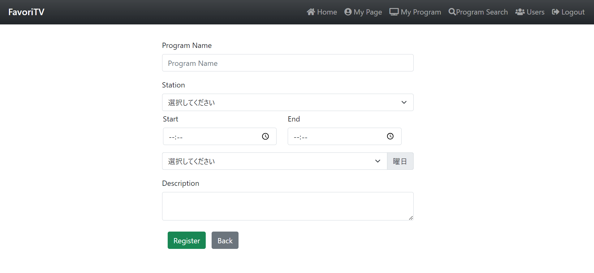
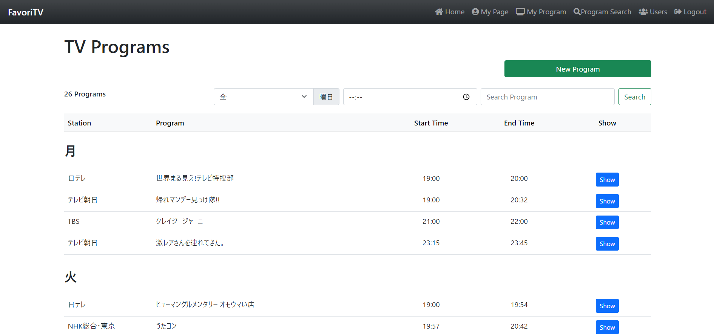

# Flask FavoriTV app

お気に入りのTV番組登録・管理アプリ

ユーザー機能、パブリックユーザーのお気に入り閲覧、番組登録・検索、出演者情報編集など

## Version
- Python 3.10.6
- Flask 2.3.2
- Werkzeug 2.3.6
- Bootstrap 5.0.2
- Font Awesome 5.15.4
- sqlite3

## images
<p align="center">
  
  
  
  
  
  
  
  
  
  
  
  
  
  
  
 
 
</p>

## Usage
```
git clone https://github.com/ryhara/Flask_FavoriTV_app.git
```

mac or linux

```
python3 -m venv venv
. venv/bin/activate
pip install Flask
flask run
```

windows
```
py -3 -m venv venv
venv/Scripts/activate
pip install Flask
flask run
```
https://msiz07-flask-docs-ja.readthedocs.io/ja/latest/installation.html


### Initialize database
```
sqlite3 database.db < sql/insert.sql
```

## References
- [https://github.com/FujikiLab/dm_app](https://github.com/FujikiLab/dm_app)
- [https://msiz07-flask-docs-ja.readthedocs.io/ja/latest/installation.html](https://msiz07-flask-docs-ja.readthedocs.io/ja/latest/installation.html)
- [Bootstrap](https://getbootstrap.jp/)
- [Font awesome](https://fontawesome.com/)
- [いらすとや](https://www.irasutoya.com/)
- [TVer](https://tver.jp/)
- [番組表 Gガイド](https://bangumi.org/)
